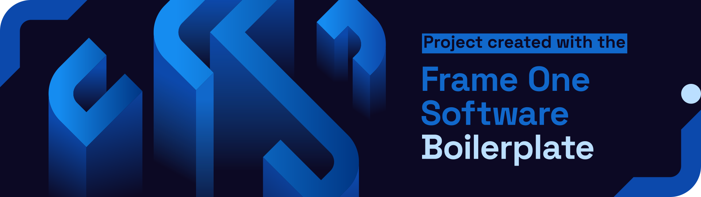

# Frame One Software Placeholder


There are numerous times during the dev ops deployments, that a placeholder container is needed. In the past, Frame One Software had used `us-docker.pkg.dev/cloudrun/container/hello`, but it is lacking a personal branding and openness to add features. The Frame One Software Placeholder is a public docker container that can be used in all of the same cases, but is catered to the tech stack of the Frame One Software Boilerplate.

### `gcr.io/frame-one-software-placeholder/image:latest`

## Example Deployment
The following is a link to an active deployment of the docker container running on cloud run.

[https://frame-one-software-placeholder-jjfbx7ct2q-uc.a.run.app](https://frame-one-software-placeholder-jjfbx7ct2q-uc.a.run.app)

## How to Run

To run the container locally, you must pull to get the latest deployment
```bash
docker pull gcr.io/frame-one-software-placeholder/image:latest
```
then you can run the latest deployment with
```bash
docker run --env PORT=8080 --publish 8080:8080 gcr.io/frame-one-software-placeholder/image
```

You can run these both together quickly with...
```bash
docker pull gcr.io/frame-one-software-placeholder/image:latest && docker run --env PORT=8080 --publish 8080:8080 gcr.io/frame-one-software-placeholder/image
```

### Docker Compose
Adding the following to a docker compose will allow pulling the image for use.

```yml
version: "3.8"

services:
  remote:
    image: gcr.io/frame-one-software-placeholder/image:latest
    ports:
      - "8080:8080"
    environment:
      PORT: 8080
```

### Other Versions
The image is public and all previous tags can be viewed here...

[https://console.cloud.google.com/gcr/images/frame-one-software-placeholder/global/image](https://console.cloud.google.com/gcr/images/frame-one-software-placeholder/global/image)


